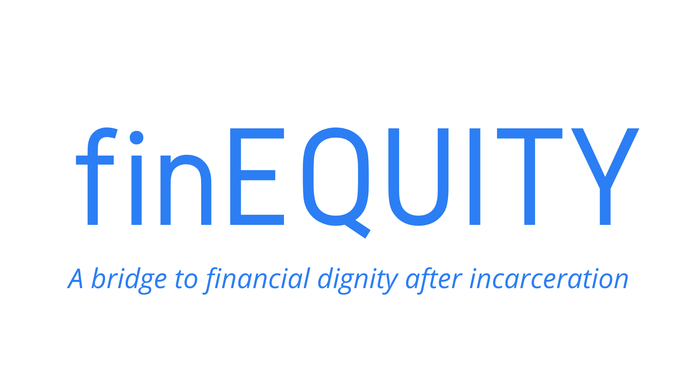
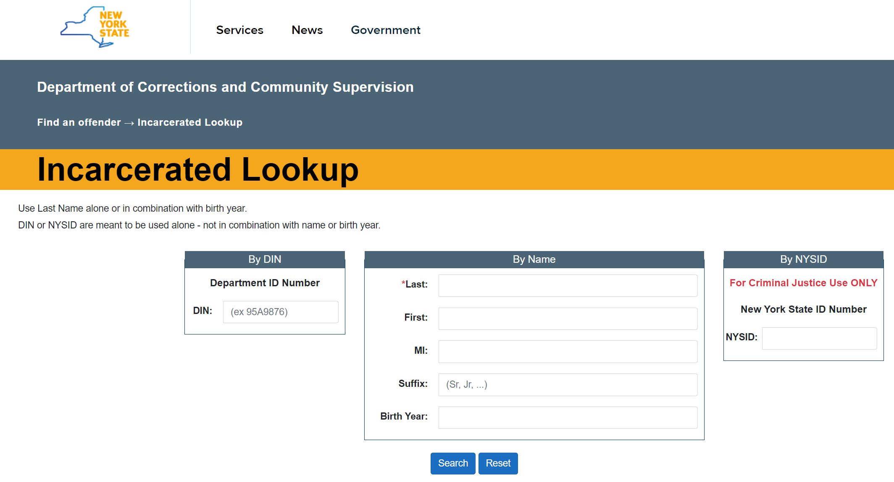
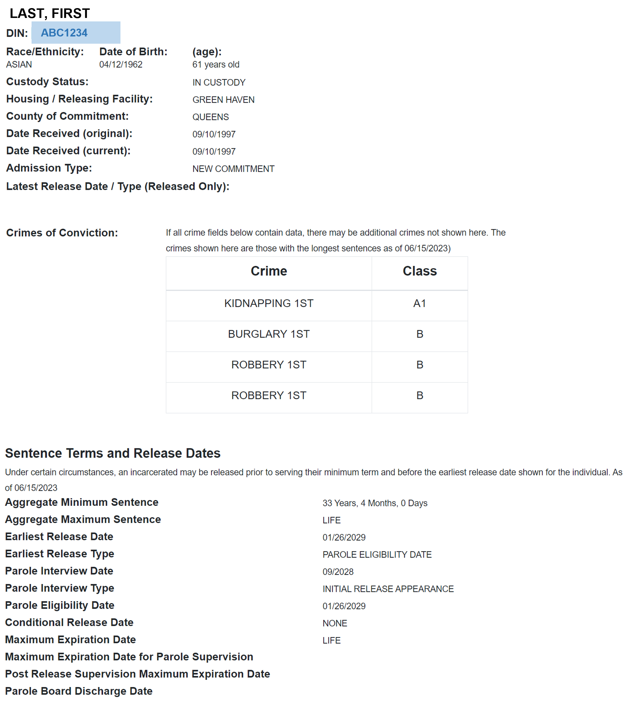

<!-- PROJECT LOGO -->
 

  
  &nbsp; &nbsp; &nbsp; &nbsp;
  

<!-- 

  <a href="https://github.com/drussel4/NYS-Incarcerated-Scraper">
    
    
    <!-- width="80" height="80" -->
  </a> -->

<h3 align="left">NYS Incarcerated Persons Webscraper</h3>

  

    The <b><i>NYS Incarcerated Persons Webscraper</i></b> crawls for information based on Department ID Numbers (DIN). It retrieves <i>name</i>, <i>status</i>, <i>facility</i>, and more. It compares these fields to the databased records in Airtable, and updates any that are stale.
     
     
  

<!-- TABLE OF CONTENTS -->

  
Table of Contents

  <ol>
    <li>
      <a href="#about-the-project">About The Project</a>
      <ul>
        <li><a href="#built-with">Built With</a></li>
      </ul>
    </li>
    <li><a href="#license">License</a></li>
    <li><a href="#contact">Contact</a></li>
  </ol>

(<a href="#top">back to top</a>)

<!-- ABOUT THE PROJECT -->
## About The Project

Via New York State's Department of Corrections and Community Supervision search portal, the scraper searches for current or formerly incarcerated individuals based on DIN.

  
  

(<a href="#top">back to top</a>)

### Built With

* [Python](https://www.python.org/)
* [Selenium](https://selenium-python.readthedocs.io/)
* [Airtable API](https://airtable.com/developers/web/api/introduction)

(<a href="#top">back to top</a>)

<!-- LICENSE -->
## License

MIT © David Russell

Distributed under the MIT License. See `LICENSE.txt` for more information.

(<a href="#top">back to top</a>)

<!-- CONTACT -->
## Contact

Dave Russell - [@data_dave_dr](https://twitter.com/data_dave_dr) - davidjeffreyrussell@gmail.com

Project Link: [https://github.com/drussel4/NYS-Incarcerated-Scraper](https://github.com/drussel4/NYS-Incarcerated-Scraper)

(<a href="#top">back to top</a>)

